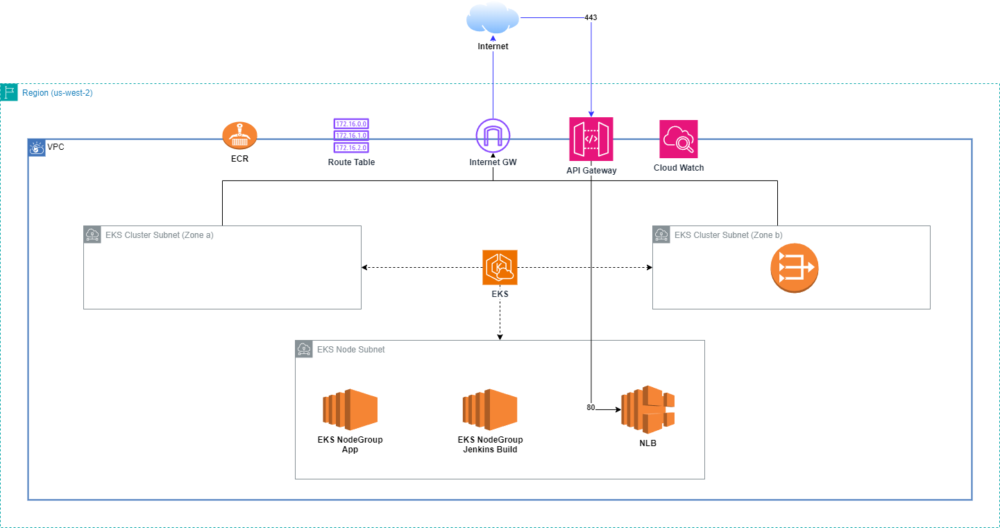
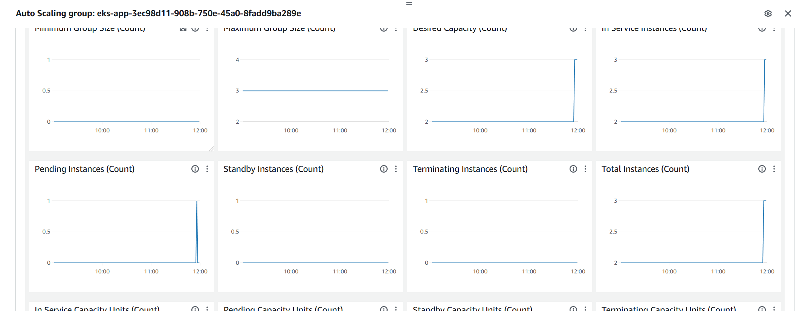
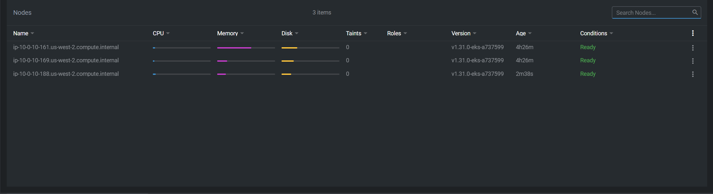
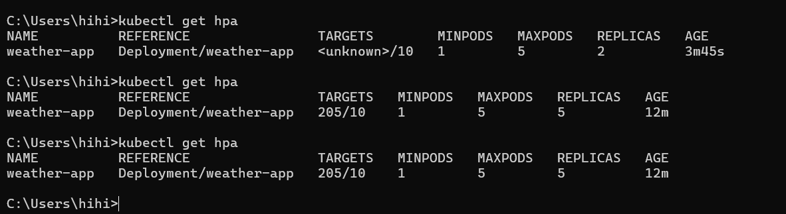
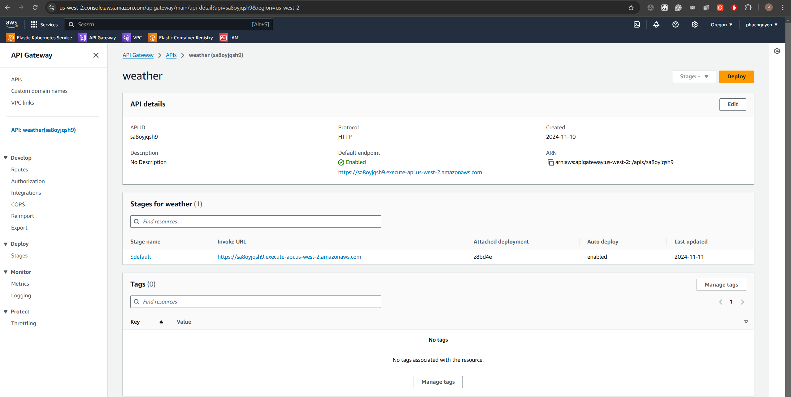
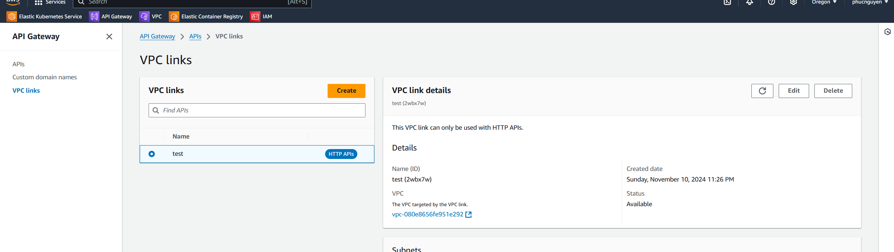
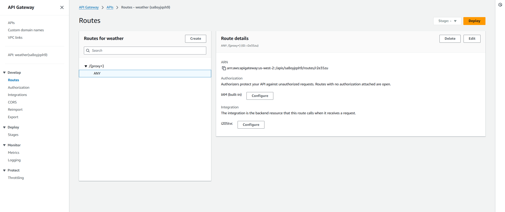
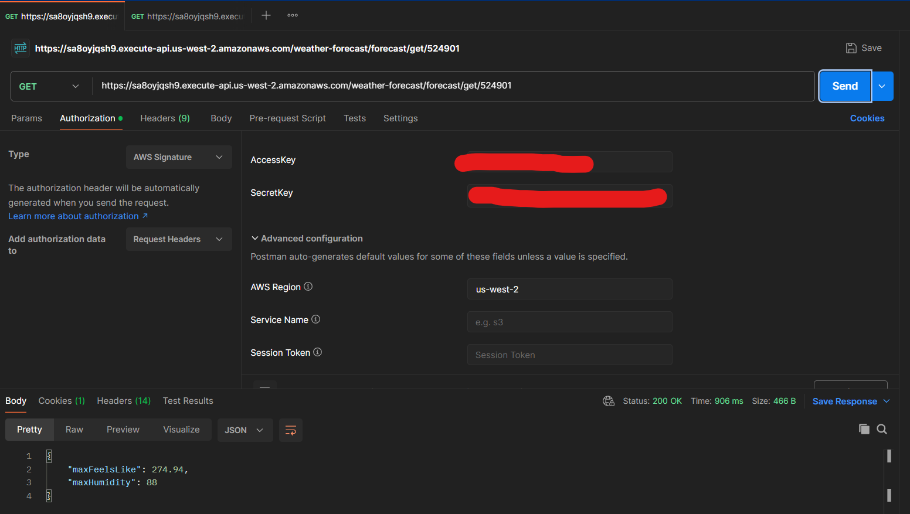
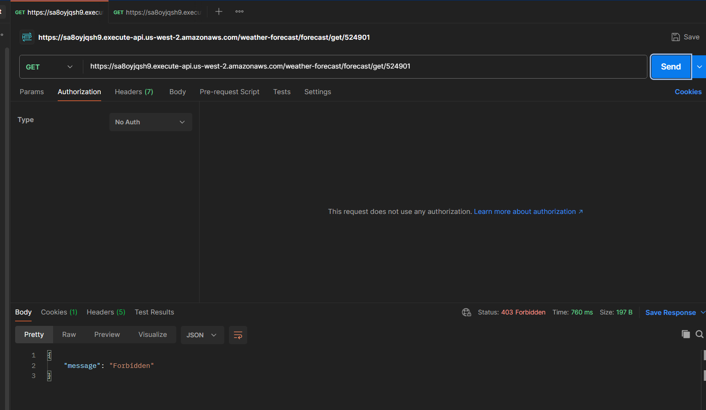

# 101digital

## Deliverables:
### Item 1 Infrastructure architecture diagram which shows all the infrastructure components required to deploy this application with logical connections between components

### Item 2 Terraform scripts to create all the infrastructure components (The Terraform code must be modularised. CloudWatch services and scaling code must be tested prior to submission)

[AWS Terraform Code](terraform/aws)

In the Terraform script, there are 2 part,
1. The first part is the module Infrastructure Require to run the app
2. The second part is the helm release resource to install necessary tool for integration
> **_NOTE:_**  In the first run please command all the helm release resource and helm provider. Sorry for this inconvient since I have limited time so the structure might not be good enough

For Autoscale, I use supported tools: prometheus and prometheus adapter to autoscale the app using metric **"http_server_requests_seconds_count_sum"**
Test Result for Autoscale

#### Node Auto Scale

#### Pod Auto Scale

> **_NOTE:_**  In the picture above I just want to show that I'm able to autoscale the node when I run the jenkins pipeline.

### Item 3 The below Kubernetes artifacts that are required to deploy the application

[Weather App](k8s-manifest/weatherapp)

> **_NOTE:_**  The nginx ingress was defined in the terraform main.tf using helm release resource

### Item 4 Jenkins pipeline script to deploy application(s) into the Kubernetes cluster
[Jenkins Pipeline](jenkins)

### Item 5 Application API deployed into AWS API gateway

I created VPN Link cause the LB is internal

### Item 6 Working postman script to demonstrate the API with proper authentication
For Authorization I used IAM BuildIn with a IAM user
1. Authorization Configuration

2. With Authorization

2. Without Authorization
